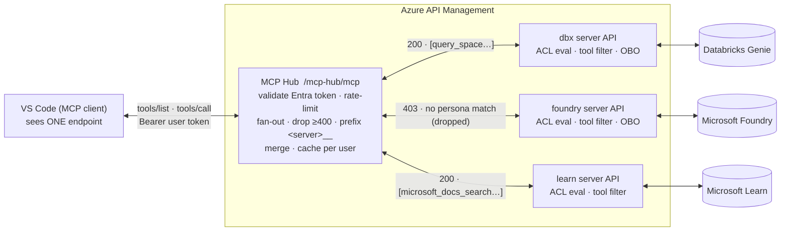
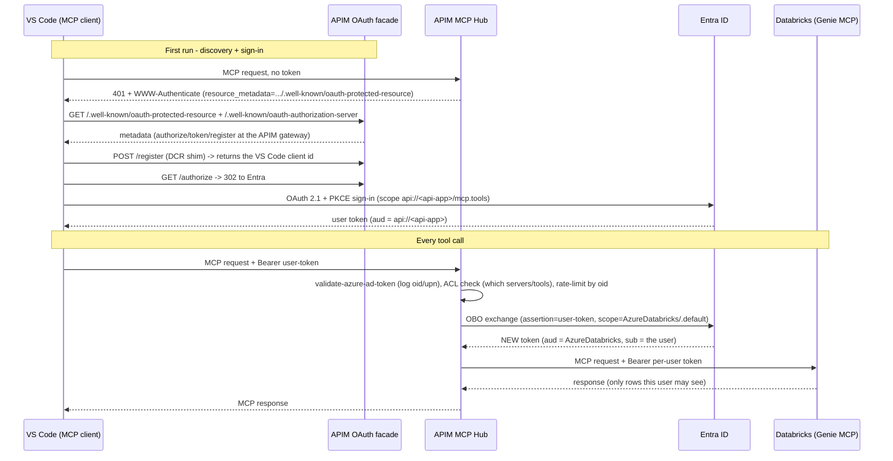
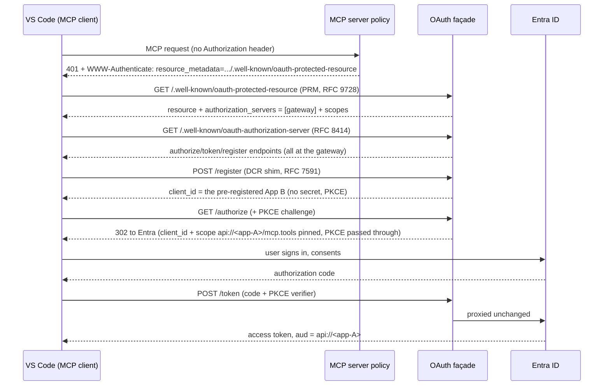

# APIM MCP Hub - Terraform

Provisions the in-path **governance + per-user identity** stack that shows how inserting **Azure API Management (APIM)** into the MCP request path gives a customer full observability **and per-user access control** over every MCP tool call - without changing the GitHub Copilot developer experience.

**Demo flow:** GitHub Copilot (VS Code) -> APIM **MCP Hub** (thin aggregator: auth + fan-out + merge) -> per-server **native APIM MCP servers** (`mcp-servers/<name>/mcp`, hub-only) -> backend MCP servers (Azure Databricks Genie, Microsoft Foundry, Microsoft Learn).

Every caller authenticates with their **Microsoft Entra ID** identity. The hub validates the token and broadcasts `tools/list` to the per-server APIs; each per-server policy evaluates its **persona ACL** (shared `mcp-acl-eval` policy fragment, with a Microsoft Graph group-membership fallback), filters the tool list, and - for Entra-protected backends - performs an OAuth 2.0 **On-Behalf-Of (OBO)** exchange to mint a **per-user** backend token before forwarding. Backends see the real user and enforce that user's permissions. There is **no shared data credential** - the broker secret only mints tokens. The per-server APIs are gated to hub-originated traffic by the `X-MCP-Internal-Key` shared secret.

## Fan-out & aggregation

The hub presents **one MCP endpoint** to the client while brokering many servers behind it. `tools/list` is a **broadcast fan-out**: the hub calls every per-server API in parallel, each server filters its own tool list by the caller's persona ACL, and the hub **aggregates** the survivors into a single prefixed list. `tools/call` never broadcasts - the `<server>__` prefix routes it to exactly one server.



`tools/list` fans out to **all** servers and the hub merges the survivors into one prefixed list (`dbx__query_space…`, `learn__microsoft_docs_search…`). `tools/call dbx__<tool>` is routed by prefix to the **dbx** server only. Every hub → server hop carries the user token plus the `X-MCP-Internal-Key` shared secret.

---

## Architecture



**Two tokens, two trust boundaries.** APIM never forwards the caller's token to Databricks (no token passthrough). It uses the caller's token plus its own client secret to have Entra mint a *distinct* token whose audience is Azure Databricks and whose subject is the calling user.

---

## What this deploys

| Resource | Provider | Module |
|---|---|---|
| Resource Group | azurerm | `modules/azurerm/resource_group` |
| Log Analytics workspace | azurerm | `modules/azurerm/log_analytics_workspace` |
| Application Insights (workspace-based) | azurerm | `modules/azurerm/application_insights` |
| API Management (Developer/BasicV2, system-assigned identity, **TLS 1.2-only / weak ciphers disabled**) | azurerm | `modules/azurerm/api_management` |
| APIM -> App Insights logger | azurerm | `modules/azurerm/apim_logger` |
| APIM global diagnostic (**`body_bytes = 0`**, MCP-safe) | azurerm | `modules/azurerm/apim_diagnostic` |
| APIM secret named value (`obo-client-secret`, encrypted at rest in APIM) | azurerm | `modules/azurerm/apim_named_value` |
| **MCP Hub** (thin aggregated MCP API + rendered hub policy + `mcp-hub-internal-key` secret + debug/Graph-fallback toggles) | azurerm | `modules/azurerm/apim_mcp_hub` (gated by `mcp_hub_enabled`) |
| **Per-server native MCP servers** (one `type = "mcp"` API per `mcp_hub_servers` entry, shown under **MCP Servers** in the portal; ACL named value + per-server policy: hub-only gate, ACL eval, tool filtering, OBO, rate limit) | azapi (`2025-09-01-preview`) + azurerm | `modules/azurerm/apim_mcp_server` (one per hub entry) |
| **`mcp-acl-eval` policy fragment** (shared ACL evaluation: token claims + Graph `checkMemberGroups` fallback) | azurerm | inline in `project/main.tf` |
| MCP observability workbook (per-user / per-tool dashboards) | azurerm | `modules/azurerm/monitor_workbook` |
| Azure Databricks workspace (optional) | azurerm | `modules/azurerm/databricks_workspace` |
| **OAuth authorization-server facade** (PRM + AS metadata + authorize/token/register at the gateway root) | azurerm | `modules/azurerm/apim_oauth_facade` (gated by `oauth_facade_enabled`, default on) |
| **Entra app registrations** (App A + App B + OBO secret + `knownClientApplications` + Databricks delegated permission) | azuread (optional) | `modules/azuread/mcp_entra_apps` (gated by `create_entra_apps`, default off) |
| **Graph roles on the APIM identity** (`GroupMember.Read.All` **and** `User.ReadBasic.All` - both are required by the group-ACL fallback) | azuread (optional) | inline in `project/main.tf` (gated by `apim_graph_role_assignment_enabled`, default off) |

### Coverage: what is / isn't Terraform-able

- **Native `azurerm` (most of the runtime stack):** RG, Log Analytics, App Insights, APIM, logger, diagnostic, named values, the **hub API + policy**, the **`mcp-acl-eval` fragment**, the per-server **policies**, the **OAuth facade**, the workbook, and the optional Databricks workspace.
- **`azapi` (preview RP):** the per-server APIs are **native MCP servers** (`Microsoft.ApiManagement/service/apis@2025-09-01-preview` with `type = "mcp"`) so they appear under **MCP Servers** in the portal. This is the ONLY api-version with the `mcp` type - it requires `Azure/azapi` >= 2.11 (`terraform init -upgrade` if the lock file pins older).
- **`azuread` provider (optional):** both Entra app registrations, the OBO client secret, the app linking, the Databricks delegated permission (`create_entra_apps = true`), and the two Graph app roles for the group-ACL fallback (`apim_graph_role_assignment_enabled = true`).
- **Manual (portal / CLI):**
  1. **Consent** for all permission legs: client -> `mcp.tools`, and **App A -> each OBO backend** (Databricks `user_impersonation`, Foundry `Foundry.Mcp.Tools`) - needs a directory admin; exact scripts in [Consent](#consent). **Without these, every OBO exchange fails (`AADSTS65001`) and the OBO servers silently drop out of tool discovery.**
  2. The **Graph app roles** on the APIM managed identity when the deployer lacks directory privileges (`apim_graph_role_assignment_enabled = false`) - script in [Graph roles for the group-ACL fallback](#graph-roles-for-the-group-acl-fallback).
  3. **Databricks SCIM provisioning + Unity Catalog / Genie grants** and the **Genie Space** (no Terraform resources exist).
  4. The **VS Code client config** (`mcp.json`).

Net: everything with an ARM or Graph API is IaC; only consent, directory-privileged grants, backend user provisioning, and the client config are out-of-band.

---

## Folder structure

```
terraform/
├── environments/dev/        # Provider config, random suffix, tfvars
├── project/                 # Orchestration: names + module wiring + hub policy rendering
│   └── templates/           # hub-mcp-policy.xml.tftpl + mcp-acl-eval.fragment.xml
└── modules/
    ├── azurerm/             # Native modules (incl. apim_mcp_hub, apim_mcp_server, apim_oauth_facade)
    └── azuread/             # Optional Entra app registrations (mcp_entra_apps)
examples/
└── mcp.json                 # VS Code / GitHub Copilot client config (the hub endpoint)
docs/
└── mcp-hub-design.md        # Hub design: ACL semantics, prefixing, caching, debug
```

---

## Prerequisites

- **Terraform >= 1.5**, **Azure CLI** (`az login`, **PowerShell 7**.
- Providers (auto-installed on `init`): `hashicorp/azurerm ~> 4.0`, `Azure/azapi ~> 2.0` (**>= 2.11 required** for the `mcp` API type - run `terraform init -upgrade` if the lock file pins older), `hashicorp/azuread ~> 3.0`, `hashicorp/random ~> 3.0`.
- A **Databricks workspace** with a **managed MCP endpoint** (a Genie Space), if you onboard a Databricks server to the hub. The `backend_url` **must include the Genie space ID as the last path segment**: `https://adb-<id>.<n>.azuredatabricks.net/api/2.0/mcp/genie/<space-id>`. Omitting it makes Databricks return `NOT_FOUND: Space with id mcp not found`.
- **Databricks SCIM provisioning from Entra** so callers map to real Databricks users, plus per-user Unity Catalog / Genie grants (see [Identities](#identities-microsoft-entra-id--databricks)).
- **Two Entra app registrations** (see [Identities](#identities-microsoft-entra-id--databricks)). Creating them needs app-registration rights; granting tenant-wide consent needs a **directory admin** (a per-user fallback is documented).
- Permission to create the resources above in the target subscription.

---

## Deployment runbook (from scratch)

The clean end-to-end sequence. Each step links to its detailed instructions below; the order respects the dependencies noted at the end.

1. **Authenticate** — `az login` and pin the target subscription ([details](#1-authenticate-to-azure)).
2. **Entra identities** — either set `create_entra_apps = true` (Terraform creates both app registrations, the OBO secret, the app linking and the Databricks permission), or create them manually ([details](#identities-microsoft-entra-id--databricks)) and record `mcp_api_app_id`, `mcp_client_app_id`, `obo_client_secret`.
3. **Prepare Databricks** (if onboarding a Databricks server) — create the [Genie Space](#1-create-a-databricks-genie-space) (note the **space ID**) and set up [SCIM provisioning + per-user grants](#databricks---user-provisioning--grants).
4. **Fill in `terraform.tfvars`** — `subscription_id`, `entra_tenant_id`, `publisher_email`, `mcp_hub_enabled = true`, the **`mcp_hub_servers`** registry (backend URLs, auth mode, persona ACLs), and either `create_entra_apps = true` or the three Entra values from step 2 ([details](#3-fill-in-your-variables-file)).
5. **Provision everything** — `terraform init && terraform plan && terraform apply` ([details](#4-init-plan-apply)). This creates the infra, the **hub**, the **per-server MCP servers**, the **OAuth façade**, and (optionally) the **Entra apps** — no scripts. Budget ~30–45 min for APIM on `Developer_1`.
6. **Grant consent** — admin-consent the client leg AND create the two `oauth2PermissionGrants` for App A's OBO legs (Databricks `user_impersonation`, Foundry `Foundry.Mcp.Tools`) ([details](#consent)). **Skipping this is the #1 cause of "only the public server's tools show up"** — the OBO exchange fails with `AADSTS65001` and those servers drop out of discovery.
7. **Grant the Graph roles** for the group-ACL fallback if any ACL uses `match_type = "group"` — `GroupMember.Read.All` **and** `User.ReadBasic.All` on the APIM managed identity ([details](#graph-roles-for-the-group-acl-fallback)).
8. **Connect VS Code** to the `mcp_hub_url` output and complete the browser sign-in ([details](#5-connect-vs-code)).
9. **Verify** — generate traffic and check the [per-user telemetry](#show-the-observability). Any failure maps to a row in [Troubleshooting](#troubleshooting).

> **Dependencies:** consent (6) needs the apps from step 2 (or the `terraform apply` in step 5 when `create_entra_apps = true`). Databricks provisioning (3) can happen any time before you test in VS Code (7). Only consent and backend user provisioning are out-of-band (see [Coverage](#coverage-what-is--isnt-terraform-able)).

---

## Quick start

### 1. Authenticate to Azure

```bash
az login
az account set --subscription "<your-subscription-id>"
az account show   # confirm the right subscription
```

### 2. Set up the Entra identities

**Option A (recommended): let Terraform create them.** Set `create_entra_apps = true` in tfvars - Terraform creates App A (with the `mcp.tools` scope, the `api://<id>` identifier URI, the OBO secret, and the Databricks `user_impersonation` permission), App B (public client + loopback redirects), and links them via `knownClientApplications`. The secret never touches tfvars; it's generated and wired straight into the APIM named value. Only [consent](#consent) remains manual.

**Option B: create them manually.** Follow [Identities](#identities-microsoft-entra-id--databricks) and record `entra_tenant_id`, `mcp_api_app_id`, `mcp_client_app_id`, and `obo_client_secret` for the tfvars.

### 3. Fill in your variables file

```bash
cd terraform/environments/dev
cp terraform.tfvars.example terraform.tfvars
```

`terraform.tfvars` is git-ignored (it holds a secret). Set at minimum:

- **`subscription_id`** - the target subscription GUID.
- **`entra_tenant_id`** - your Entra tenant GUID.
- **`create_entra_apps = true`**, or the three manual values: **`mcp_api_app_id`**, **`mcp_client_app_id`**, **`obo_client_secret`** (prefer `TF_VAR_obo_client_secret` over writing the secret into the file).
- **`publisher_email`** - APIM admin contact.
- **`mcp_hub_enabled = true`** and the **`mcp_hub_servers`** map - one entry per backend MCP server: `backend_url` (full endpoint URL; for Databricks Genie it must end with the space ID), `auth` (`"obo"` or `"none"`), `obo_scope` (for OBO servers), and up to 3 persona `acl` entries. See [terraform.tfvars.example](terraform/environments/dev/terraform.tfvars.example) and [Onboarding a server to the hub](#onboarding-a-server-to-the-hub).
- Optional: **`apim_graph_role_assignment_enabled = true`** to have Terraform grant the APIM identity the two Graph app roles that `mcp_hub_graph_fallback` needs - `GroupMember.Read.All` **and** `User.ReadBasic.All` (the deployer must hold directory privileges and a fresh `az login`; manual script in [Graph roles for the group-ACL fallback](#graph-roles-for-the-group-acl-fallback)).

### 4. Init, plan, apply

```bash
terraform init
terraform plan
terraform apply
```

If the named value fails on the first apply due to propagation timing, re-run `terraform apply`.

> State is local by default. For team use add an `azurerm` backend to `environments/dev/main.tf` and re-run `terraform init`.

### Key outputs after apply

- **`mcp_hub_url`** - the aggregated hub endpoint (`https://<apim>.azure-api.net/mcp-hub/mcp`); goes into `.vscode/mcp.json`.
- **`mcp_server_urls`** - the per-server MCP endpoints (`.../mcp-servers/<name>/mcp`). Hub-only: they reject requests without the hub's `X-MCP-Internal-Key` (including the portal's MCP "Tools" test blade - a 401 there is expected).
- **`mcp_hub_policy_xml`** - the rendered hub policy (applied by Terraform; exported for review).
- **`mcp_hub_acl_named_values`** - the per-server ACL named-value content (edit the `mcp-acl-<server>` named values post-deploy to change persona tool lists without a policy redeploy).
- **`mcp_api_app_id`, `mcp_client_app_id`** - the effective app registration IDs (Terraform-created or from tfvars); needed for the consent commands.
- **`prm_well_known_url`, `oauth_scope`, `entra_tenant_id`** - OAuth discovery values (the facade itself is deployed by Terraform).
- **`mcp_named_value_name`** - the secret named value (`obo-client-secret`) to `refreshSecret` after rotation.
- **`apim_name`, `apim_gateway_url`, `application_insights_name`, `resource_group_name`** - resource names (with the random suffix).

---

## Identities (Microsoft Entra ID + Databricks)

OBO requires **two** Entra app registrations plus Databricks user provisioning.

> **Terraform can create all of this except consent.** With `create_entra_apps = true`, the `modules/azuread/mcp_entra_apps` module creates App A (scope, identifier URI, secret, Databricks permission), App B (public client), and the `knownClientApplications` link - skip straight to [Consent](#consent) (using the `mcp_api_app_id` / `mcp_client_app_id` outputs). The manual steps below are the equivalent portal/CLI procedure when you can't or don't want Terraform to own the app registrations.

Create the apps under **Entra ID -> App registrations**.

### App A - the API app (OBO middle-tier) -> `mcp_api_app_id`

1. **Register** an app, e.g. `apim-mcp-api`. Record its **Application (client) ID** -> `mcp_api_app_id`, and your **Directory (tenant) ID** -> `entra_tenant_id`.
2. **Expose an API** -> set **Application ID URI** to `api://<mcp_api_app_id>` -> **Add a scope** `mcp.tools` (admins and users can consent).
3. **Certificates & secrets** -> **New client secret** -> copy the **value** -> `obo_client_secret`.
4. **API permissions** -> **Add a permission** -> **APIs my organization uses** -> **AzureDatabricks** (`2ff814a6-3304-4ab8-85cb-cd0e6f879c1d`) -> **Delegated** -> **user_impersonation** -> **Add**. This lets APIM request an OBO token for Databricks on behalf of the user.

> **App A owns the secret and the Databricks permission.** In `terraform.tfvars`, `mcp_api_app_id` = this app and `obo_client_secret` = this app's secret. A common mistake is swapping `mcp_api_app_id` and `mcp_client_app_id` - if the OBO exchange fails with `AADSTS7000215 (invalid client secret)`, verify the secret belongs to `mcp_api_app_id` and that `api://<mcp_api_app_id>` is the app that **exposes** `mcp.tools`.

### App B - the VS Code public client -> `mcp_client_app_id`

1. **Register** an app, e.g. `vscode-mcp-client`. Record its **Application (client) ID** -> `mcp_client_app_id`.
2. **Authentication** -> **Add a platform** -> **Mobile and desktop applications** -> add redirect URIs `http://localhost` and `http://127.0.0.1` -> enable **Allow public client flows**. Missing this surfaces as `AADSTS500113: No reply address is registered for the application` after sign-in.
   ```powershell
   az ad app update --id <app-B> --public-client-redirect-uris "http://localhost" "http://127.0.0.1" --set isFallbackPublicClient=true
   ```
3. **API permissions** -> **Add a permission** -> **My APIs** -> select **App A** -> **Delegated** -> `mcp.tools` -> **Add**.

### Link the two apps (combined consent)

Set `knownClientApplications` on **App A** to include **App B**. This makes Entra prompt the user, during the client sign-in, to consent to *both* the client->API and the API->Databricks permissions at once - the OBO middle-tier can't prompt for consent itself.

```powershell
$oidA = az ad app show --id <app-A> --query id -o tsv
$body = '{"api":{"knownClientApplications":["<app-B>"]}}'
[System.IO.File]::WriteAllText("$env:TEMP\kca.json", $body, (New-Object System.Text.UTF8Encoding($false)))
az rest --method patch --url "https://graph.microsoft.com/v1.0/applications/$oidA" --headers "Content-Type=application/json" --body "@$env:TEMP\kca.json"
```

### Consent

All permission legs need consent: client -> `mcp.tools`, and **App A -> each OBO backend**. Without the App A legs, **every OBO exchange fails with `AADSTS65001`**, the per-server policies return `502`, and the OBO servers silently vanish from `tools/list` (only public servers' tools appear).

- **Client leg (App B -> App A `mcp.tools`):**
  ```powershell
  az ad app permission admin-consent --id <app-B>   # client -> mcp.tools
  ```
- **OBO legs (App A -> Databricks + Foundry) - create the tenant-wide delegated grants directly** (verified working; `az ad app permission admin-consent --id <app-A>` only covers permissions listed in the app's `requiredResourceAccess`, which the Foundry leg is not):
  ```powershell
  $apiSpId = az ad sp show --id <mcp_api_app_id> --query id -o tsv
  $dbxSpId = az ad sp show --id 2ff814a6-3304-4ab8-85cb-cd0e6f879c1d --query id -o tsv   # AzureDatabricks first-party SP
  # Foundry MCP App SP (first-party; look it up by its identifier URI):
  $fndSpId = az rest --url "https://graph.microsoft.com/v1.0/servicePrincipals?`$filter=servicePrincipalNames/any(n:n eq 'https://mcp.ai.azure.com')&`$select=id" --query "value[0].id" -o tsv

  # App A -> AzureDatabricks : user_impersonation
  @{ clientId = $apiSpId; consentType = "AllPrincipals"; resourceId = $dbxSpId; scope = "user_impersonation" } |
    ConvertTo-Json | Set-Content grant1.json
  az rest --method POST --url "https://graph.microsoft.com/v1.0/oauth2PermissionGrants" --body '@grant1.json' --headers "Content-Type=application/json"

  # App A -> Foundry MCP App : Foundry.Mcp.Tools
  @{ clientId = $apiSpId; consentType = "AllPrincipals"; resourceId = $fndSpId; scope = "Foundry.Mcp.Tools" } |
    ConvertTo-Json | Set-Content grant2.json
  az rest --method POST --url "https://graph.microsoft.com/v1.0/oauth2PermissionGrants" --body '@grant2.json' --headers "Content-Type=application/json"

  Remove-Item grant1.json, grant2.json
  ```
  Creating `oauth2PermissionGrants` needs a **directory admin** (`Authorization_RequestDenied` means you aren't one). Verify with:
  ```powershell
  az rest --url "https://graph.microsoft.com/v1.0/oauth2PermissionGrants?`$filter=clientId eq '$apiSpId'" --query "value[].{resource:resourceId, scope:scope}" -o table
  ```
  > **PowerShell + `az rest` gotcha:** always pass JSON bodies via a file (`--body '@file.json'`). Inline JSON gets its quotes stripped by PowerShell, `az` then fails to detect the content and Graph returns `Write requests ... must contain the Content-Type header declaration`.
- **Per-user fallback (no admin, tenant allows user consent):** replace `consentType = "AllPrincipals"` with `consentType = "Principal"; principalId = <your-user-object-id>` in the grants above - each developer self-consents once.

### Databricks - user provisioning + grants

1. **Provision users into Databricks via SCIM** from Entra (the **Azure Databricks SCIM Provisioning Connector** enterprise app, or the account-console SCIM connector). The token's `oid`/`upn` must map to a real Databricks principal or Databricks returns `403`.
2. Grant each user (or an Entra group) **Unity Catalog** privileges (catalog/schema/table `SELECT`) and **Genie space** access. This is the per-user boundary OBO enforces.

### Graph roles for the group-ACL fallback

Entra access tokens from these app registrations carry **no `groups` claim** (the standalone `azuread_application_registration` resources can't set `groupMembershipClaims`), so any ACL entry with `match_type = "group"` relies on the policy's **Graph fallback**: the APIM managed identity calls `checkMemberGroups` on `/users/{oid}` (transitive, cached per user 300s). That call requires **BOTH** Graph application roles - per the Graph permission table for "group memberships for other users", `GroupMember.Read.All` alone gets a `403`:

| Role | App role ID |
|---|---|
| `GroupMember.Read.All` | `98830695-27a2-44f7-8c18-0c3ebc9698f6` |
| `User.ReadBasic.All` | `97235f07-e226-4f63-ace3-39588e11d3a1` |

- **Terraform** (deployer has directory privileges): set `apim_graph_role_assignment_enabled = true` - both roles are granted by `azuread_app_role_assignment.apim_graph_fallback`.
- **Manual** (admin runs; managed identities can't be granted through the portal's API-permissions blade):
  ```powershell
  $apimPrincipalId = az apim show -g <rg> -n <apim-name> --query identity.principalId -o tsv
  $graphSpId = az ad sp show --id 00000003-0000-0000-c000-000000000000 --query id -o tsv
  foreach ($roleId in "98830695-27a2-44f7-8c18-0c3ebc9698f6", "97235f07-e226-4f63-ace3-39588e11d3a1") {
    @{ principalId = $apimPrincipalId; resourceId = $graphSpId; appRoleId = $roleId } | ConvertTo-Json | Set-Content body.json
    az rest --method POST --url "https://graph.microsoft.com/v1.0/servicePrincipals/$apimPrincipalId/appRoleAssignments" --body '@body.json' --headers "Content-Type=application/json"
  }
  Remove-Item body.json
  ```

> **Managed-identity token cache gotcha:** APIM caches the MI's Graph token **per resource string until it expires (~24h)**. A token acquired *before* a role grant will not contain the role, and the fallback keeps failing even though the grant is correct. If you grant roles after APIM has already attempted the fallback, rotate the `resource` attribute of `authentication-managed-identity` in [mcp-acl-eval.fragment.xml](terraform/project/templates/mcp-acl-eval.fragment.xml) to an equivalent variant (`https://graph.microsoft.com`, the trailing-slash form, or the GUID `00000003-0000-0000-c000-000000000000`) and apply - the new cache key forces a fresh token. With `mcp_hub_debug = true`, the per-server trace's `graph-fallback` field distinguishes `failed(token-acquisition)` / `failed(http-403)` / `verified=N/M`.

---

## Manual steps (after `terraform apply`)

Terraform has already provisioned APIM, the `obo-client-secret` named value, diagnostics, the workbook, **and the MCP Hub itself** (API + policy + ACL named values). Complete these out-of-band.

### 1. Create a Databricks Genie Space

In the Databricks workspace, create a **Genie Space** so the managed MCP endpoint has tools to expose. Note the **space ID** and confirm the `dbx` entry's `backend_url` in `mcp_hub_servers` ends with it (`.../api/2.0/mcp/genie/<space-id>`). A missing/wrong space ID is the most common cause of `404` / empty tool list.

### 2. (Identities) - done in [Identities](#identities-microsoft-entra-id--databricks)

Make sure the two app registrations, `knownClientApplications`, consent, and Databricks SCIM/grants are in place before testing.

### 3. The MCP Hub + per-server MCP servers - created by Terraform (nothing to do)

The **hub** is a plain HTTP API (`POST <gateway>/mcp-hub/mcp`) and a **thin aggregator**: 401 challenge (WWW-Authenticate -> PRM) → `validate-azure-ad-token` (accepts BOTH audience forms: `api://<mcp_api_app_id>` for v1 tokens and the bare GUID for v2 tokens - the Terraform-created apps issue **v2**) → per-user rate-limit → answers `initialize`/`ping` locally (GET/DELETE answer `405` per the streamable-HTTP spec - a 404 makes clients loop on initialize) → broadcasts `tools/list` to every per-server API (forwarding the user token + `X-MCP-Internal-Key`), drops ≥400 responses, prefixes `<server>__<tool>`, merges → routes `tools/call` by prefix.

Each **per-server API** is a **native APIM MCP server** (`type = "mcp"`, visible under **MCP Servers** in the portal, hub-only via the internal key) that owns all server-specific logic: ACL evaluation via the shared `mcp-acl-eval` fragment (claims + Graph fallback), tool filtering, the optional per-user rate limit, and the **OBO exchange** (cached per user) for `auth = "obo"` / auth-strip for `auth = "none"`. `tools/list` is answered entirely inbound via `send-request` (MCP-type policies must NEVER read `context.Response.Body` - it breaks the streaming pipeline); `tools/call` flows through APIM's native MCP pipeline to the backend `serviceUrl`. No ACL match → `403` (the hub hides the server); denied tool → JSON-RPC `-32602` (the backend is never contacted); OBO failure → `502` with the raw Entra `AADSTS…` body, plus an App Insights error trace (`MCP server OBO exchange failed`) when `mcp_hub_debug = true`.

ACL edits are named-value-only (`mcp-acl-<server>`, ~30s, no redeploy); onboarding a server = one `mcp_hub_servers` entry + `terraform apply`. Tool-list changes take up to 2× `mcp_hub_tools_cache_seconds` to reach clients (hub per-user cache + per-server per-ACL cache).

After rotating the secret (or if the named value looks stale), refresh it:

```powershell
$sub  = "<your-subscription-id>"
$rg   = terraform output -raw resource_group_name
$apim = terraform output -raw apim_name
$base = "https://management.azure.com/subscriptions/$sub/resourceGroups/$rg/providers/Microsoft.ApiManagement/service/$apim"
az rest --method post --url "$base/namedValues/obo-client-secret/refreshSecret?api-version=2024-05-01"
```

### 4. The OAuth authorization-server facade - created by Terraform (nothing to do)

VS Code's MCP client can't use Entra directly as its authorization server (no Dynamic Client Registration; wrong metadata shape) - it falls back to `https://<gateway>/authorize` and gets a **404**. The facade makes APIM the authorization server it discovers, brokering to Entra. PKCE flows end-to-end between VS Code and Entra, so no session storage/consent page/CosmosDB is needed (unlike the full [AI-Gateway lab](https://github.com/Azure-Samples/AI-Gateway/tree/main/labs/mcp-client-authorization)).

It is deployed by the `modules/azurerm/apim_oauth_facade` module (gated by `oauth_facade_enabled`, default `true`) and publishes at the gateway root: `GET /.well-known/oauth-protected-resource` (the Terraform-rendered PRM), `GET /.well-known/oauth-authorization-server`, `GET /authorize` (302 -> Entra), `POST /token` (proxy -> Entra), `POST /register` (DCR shim -> App B), plus OPTIONS CORS handlers.

Verify after apply:

```powershell
$gw = terraform output -raw apim_gateway_url
curl.exe -s -o NUL -w "%%{http_code}" "$gw/.well-known/oauth-protected-resource"    # expect 200
curl.exe -s -o NUL -w "%%{http_code}" "$gw/.well-known/oauth-authorization-server"  # expect 200
curl.exe -s -o NUL -w "%%{http_code}" "$gw/authorize"                               # expect 302
```

### 5. Connect VS Code

Copy [examples/mcp.json](examples/mcp.json) to your repo's `.vscode/mcp.json` and set the `url` to the `mcp_hub_url` output - no headers, no key:

```jsonc
{
  "servers": {
    "mcp-hub-apim": {
      "type": "http",
      "url": "https://<apim-name>.azure-api.net/mcp-hub/mcp"
    }
  }
}
```

Start the server. VS Code hits the `401` + `WWW-Authenticate`, reads the PRM doc, fetches the facade's AS metadata, calls `/register` (gets App B's client id), then opens a browser sign-in against Entra (OAuth 2.1 + PKCE). After consent it attaches the token automatically. Switch Copilot Chat to **Agent** mode -> **Tools** -> enable the hub tools. Tool names are prefixed by server key (e.g. `dbx__query_space_…`, `learn__microsoft_docs_search`), and you only see the tools your ACL personas allow.

---

## Show the observability

Generate traffic (run a Copilot agent prompt that calls a tool), then:

- **APIM -> Monitoring -> Metrics:** metric `Requests`, split by Response Code.
- **App Insights -> Transaction Search / Application Map:** each tool call is a `request`; the outbound Databricks call is a `dependency`.
- **App Insights -> Logs (KQL):**

```kusto
requests
| where timestamp > ago(30m)
| where url has "/mcp" or name has "mcp"
| project timestamp, name, url, resultCode, duration, client_IP
| order by timestamp desc
```

```kusto
// Every tool call attributed to a verified Entra identity
traces
| where message == "MCP tool call through APIM (OBO)"
| extend callerUpn = tostring(customDimensions["caller-upn"]),
         callerOid = tostring(customDimensions["caller-oid"])
| project timestamp, callerUpn, callerOid, operation_Name
| order by timestamp desc
```

Because Databricks receives a **per-user** token, the same activity is *also* attributed to the user in Databricks' own **Unity Catalog audit logs / Genie query history** - end-to-end attribution across both planes. Rate-limiting is per user (`counter-key` = `oid`); trip it (more than `rate_limit_calls` in `rate_limit_period`) to show a per-identity `429`.

---

## Authentication schemes: how APIM can front an MCP backend

Every request through the gateway has **two legs**, and each leg can be secured independently:

1. **Client -> APIM** (the *inbound* leg): who is the caller, and can APIM prove it?
2. **APIM -> backend** (the *outbound* leg): what credential (if any) does the backend see?

In this repo the inbound leg is always the same - a per-user Microsoft Entra ID token obtained through OAuth 2.1 + PKCE (via the [OAuth façade](#how-the-policies-work-together-the-oauth-façade--the-mcp-server-policies)) and validated by `validate-azure-ad-token`. What varies is the **outbound** leg. The schemes below are ordered roughly from strongest to weakest identity guarantees.

| # | Scheme | Backend sees | Per-user backend authz | Backend audit shows | Standing secret | Used in this repo |
|---|---|---|---|---|---|---|
| 1 | [On-Behalf-Of exchange](#scheme-1-on-behalf-of-obo-token-exchange) | A fresh per-user token minted for the backend audience | **Yes** (backend enforces the real user's grants) | The **real user** | Broker secret only (mints tokens, grants no data access) | Databricks, Foundry |
| 2 | [Auth at APIM, no backend credential](#scheme-2-auth-at-apim-no-backend-credential) | Nothing (header stripped) | N/A (public backend) | Anonymous / APIM egress IP | **None** | Microsoft Learn |
| 3 | [Auth at APIM + shared key to backend](#scheme-3-auth-at-apim--shared-key-to-the-backend) | A shared PAT / API key | **No** (everyone impersonates the key's owner) | The **service account**, never the user | Yes - a live data credential | Original Databricks design (replaced by OBO) |
| 4 | [APIM managed identity -> backend](#scheme-4-apim-managed-identity---backend-app-identity) | An app-only token for APIM's identity | **No** (one app principal) | The APIM identity | None (certificate managed by Azure) | Not used (viable for app-level backends) |
| 5 | [Token passthrough](#scheme-5-token-passthrough-anti-pattern) | The caller's original token | Superficially yes - but see below | The user (misleadingly) | None | **Deliberately avoided** |
| 6 | [Subscription key only](#scheme-6-apim-subscription-key-only) | Anything from 2-4 | No user identity at all | Depends on outbound leg | APIM key per team/app | Not used (`subscriptionRequired = false`) |

### Scheme 1: On-Behalf-Of (OBO) token exchange

**What it is.** APIM validates the caller's Entra token, then exchanges it (plus its own client secret) at Entra for a **new** token whose audience is the backend resource and whose subject is still the calling user. The backend authenticates a real user and enforces that user's permissions. Implemented by the hub policy ([hub-mcp-policy.xml.tftpl](terraform/project/templates/hub-mcp-policy.xml.tftpl)) for servers with `auth = "obo"`; see the [deep dive](#deep-dive-the-on-behalf-of-obo-flow) below.

**Strengths**
- **True end-to-end identity**: the backend (Databricks Unity Catalog, Foundry RBAC) enforces *the caller's own* grants - APIM cannot over-grant, and a compromised gateway cannot read more than the current caller could.
- **Two independent audit planes**: APIM logs the caller *and* the backend logs the same caller - attribution survives even if one plane is misconfigured.
- **No standing data credential**: the only secret (App A's client secret) can mint tokens but grants no data access by itself; leaking it without a valid user assertion is useless for data exfiltration.
- Revocation and Conditional Access apply per user, centrally, in Entra.

**Weaknesses**
- **Most setup**: two app registrations, delegated permission on the backend resource, admin (or per-user) consent, and per-user provisioning in the backend (e.g. Databricks SCIM + Unity Catalog grants).
- Only works when the backend **accepts Entra tokens** for the calling tenant (Databricks, Foundry, Azure services; not arbitrary SaaS).
- The token exchange adds a network round-trip - mitigated here by the per-user cache (`obo_cache_seconds`).
- A user with no backend identity gets a `403` **by design** - onboarding is a hard dependency.

### Scheme 2: Auth at APIM, no backend credential

**What it is.** The backend is public and needs no credential (e.g. the Microsoft Learn MCP server). APIM still demands a valid Entra token inbound - the governance chokepoint is preserved - then **deletes the `Authorization` header** so the caller's token never leaves the gateway, and forwards the request unauthenticated. Implemented by the hub policy for servers with `auth = "none"`; walkthrough in [Onboarding a server to the hub](#onboarding-a-server-to-the-hub).

**Strengths**
- **Zero credential surface**: no secret, no app permission, no consent, no backend onboarding.
- Full inbound governance anyway: sign-in required, per-user rate-limit, per-identity App Insights attribution - a public tool becomes a *governed* tool.
- Trivial to add a server: no identity work at all beyond the shared inbound validation.

**Weaknesses**
- Only fits backends that genuinely require no auth - the moment the backend adds auth you must move to another scheme.
- Backend-side audit is blind (all traffic looks like APIM's egress IP); attribution exists **only** in the APIM/App Insights plane.
- No per-user data authorization at the backend - anyone who can sign in sees exactly what everyone else sees.

### Scheme 3: Auth at APIM + shared key to the backend

**What it is.** The caller authenticates to APIM per-user (same inbound validation as schemes 1-2), but APIM injects a **shared, long-lived backend credential** - a Databricks PAT, an API key - from Key Vault via a named value:

```xml
<!-- After validate-azure-ad-token + rate-limit, replace the caller token with the stored key -->
<set-header name="Authorization" exists-action="override">
  <value>Bearer {{databricks-pat}}</value>   <!-- Key Vault-backed named value -->
</set-header>
```

This was the **original design of this demo** for Databricks, before it was replaced by OBO.

**Strengths**
- **Works with any backend** that takes a key - no Entra support, consent, or per-user backend provisioning required.
- Simple: one secret in Key Vault, one policy line; users don't need backend identities.
- The inbound leg still gives you per-user attribution *at the gateway* (who called, when, how often) plus per-user rate-limiting.

**Weaknesses**
- **All callers impersonate one identity.** The backend authorizes the *key's* owner, so every user gets the union of that service account's access - least-privilege per user is impossible.
- **Backend audit is wrong**: Unity Catalog / query history attributes everything to the service account. Gateway logs and backend logs can no longer be correlated per user by the backend's own tooling.
- **Standing credential risk**: the PAT is a live data credential; leak it and data access follows. It needs rotation, scoping, and expiry management.
- A confused-deputy shape: APIM (the deputy) holds power the caller shouldn't have; only the gateway policy stands between a caller and the service account's full access.

> **Rule of thumb:** use scheme 3 only when the backend cannot accept Entra tokens (scheme 1) and isn't public (scheme 2) - and then scope the key as narrowly as the backend allows.

### Scheme 4: APIM managed identity -> backend (app identity)

**What it is.** APIM's **system-assigned managed identity** acquires an app-only token for the backend (`authentication-managed-identity` policy). Like scheme 3, the backend sees a single principal - but the "secret" is an Azure-managed certificate that never leaves the platform.

**Strengths:** no secret to store or rotate at all; native Entra RBAC on the backend for the APIM principal; the strongest option when calls are legitimately **service-level** (not on behalf of a user).

**Weaknesses:** same identity-collapse problem as scheme 3 - one principal, no per-user backend authz or audit. Only works for Entra-protected backends, at which point OBO (scheme 1) is usually the better fit for user-facing MCP traffic.

### Scheme 5: Token passthrough (anti-pattern)

**What it is.** APIM forwards the caller's inbound token to the backend unchanged. **This repo deliberately never does this**, and the [MCP authorization spec explicitly prohibits it](https://modelcontextprotocol.io/specification/draft/basic/authorization).

**Why it's tempting:** zero configuration - no exchange, no secret, and the backend "sees the user".

**Why it's wrong**
- **Audience violation**: the token was minted for `api://<mcp_api_app_id>` (APIM), not for the backend. A backend that accepts it isn't validating its audience - and any other service the token reaches could be replayed against.
- **Confused deputy / lateral movement**: every downstream hop receives a credential valid at the *gateway*, and can replay it to any other resource that mis-validates.
- Breaks the trust-boundary model: you can no longer reason about which token is valid where.

OBO is the correct version of this instinct: the backend still sees the user, but through a **new, audience-bound** token.

### Scheme 6: APIM subscription key only

**What it is.** APIM's built-in subscription keys (`Ocp-Apim-Subscription-Key`) gate the inbound leg instead of (or alongside) user tokens. This repo sets `subscriptionRequired = false` everywhere.

**Strengths:** trivial to issue/revoke per team or app; useful as a *second* factor for quota/product segmentation on top of user auth.

**Weaknesses:** a key identifies a **subscription**, not a person - no user attribution, no per-user backend authz, and keys get shared and leaked. Unsuitable alone for the "who called which tool" requirement this demo exists to answer.

---

### Deep dive: the On-Behalf-Of (OBO) flow

OBO ([RFC 8693 token exchange, as profiled by Microsoft identity platform](https://learn.microsoft.com/entra/identity-platform/v2-oauth2-on-behalf-of-flow)) lets a **middle tier** (APIM) call a **downstream resource** (Databricks/Foundry) as the **original user**, without ever holding the user's password or forwarding the user's original token.

#### The cast

| Actor | In this repo | Role in OBO |
|---|---|---|
| Public client | VS Code / GitHub Copilot (**App B**, `mcp_client_app_id`) | Signs the user in (PKCE), obtains token *for APIM* |
| Middle tier | APIM policy (**App A**, `mcp_api_app_id` + `obo_client_secret`) | Validates inbound token, performs the exchange |
| Authorization server | Microsoft Entra ID (`entra_tenant_id`) | Verifies the assertion + App A's credentials, mints the downstream token |
| Downstream resource | Databricks (`2ff814a6-.../.default`) or Foundry (`https://mcp.ai.azure.com/.default`) | Validates the new token, enforces the user's grants |

#### What happens on the wire

1. **Inbound token arrives.** VS Code sends `Authorization: Bearer <user-token>` where the token has `aud = api://<mcp_api_app_id>`, `scp = mcp.tools`, and the user's `oid`/`upn` claims. This token is only valid *at APIM* - Databricks would (correctly) reject it.
2. **APIM validates it** (`validate-azure-ad-token`): signature against the tenant's keys, issuer, expiry, audience `api://<mcp_api_app_id>`, and optionally the allowed client app (`mcp_client_app_id`).
3. **APIM calls Entra's token endpoint** (`send-request` in the policy) with five parameters:

   ```
   POST https://login.microsoftonline.com/<tenant>/oauth2/v2.0/token
   grant_type          = urn:ietf:params:oauth:grant-type:jwt-bearer
   assertion           = <the caller's validated token>          # proof a real user is present
   client_id           = <mcp_api_app_id>                        # App A identifies itself...
   client_secret       = {{obo-client-secret}}                   # ...and authenticates (secret APIM named value)
   scope               = <backend>/.default                      # what resource the new token is FOR
   requested_token_use = on_behalf_of
   ```

4. **Entra checks everything**: the assertion is a valid, unexpired token for App A; App A's secret is correct; App A holds the delegated permission on the target resource (e.g. `AzureDatabricks/user_impersonation`); and the **user (or an admin) has consented** to that permission. Any failure surfaces as an `AADSTS` error in a `502` from the policy.
5. **Entra mints a new token**: `aud` = the backend resource, `sub`/`oid` = **the original user**, scopes = the granted delegated permissions. This is a *different* token - the caller's token never leaves APIM.
6. **APIM caches and forwards.** The new token is cached per user (`cache-store-value`, key `<prefix>-obo-<oid>`, TTL `obo_cache_seconds`) and set as the outbound `Authorization` header. Databricks validates it like any Entra token and applies **that user's** Unity Catalog / Genie grants.

**Two tokens, two trust boundaries** - the whole point in one line:

```
Token 1:  user ──► APIM        aud = api://<mcp_api_app_id>   (never forwarded)
Token 2:  APIM ──► backend     aud = backend, sub = the user  (minted per user, cached)
```

#### How it's configured (checklist)

| Piece | Where | What it does |
|---|---|---|
| App A (`mcp_api_app_id`) exposes `api://<id>/mcp.tools` | Entra ([Identities](#identities-microsoft-entra-id--databricks)) | Defines the inbound audience the policies validate |
| App A **client secret** | Entra -> secret APIM named value `obo-client-secret` | Authenticates the middle tier in step 3; never visible to callers |
| App A **delegated permission** on the backend (Databricks `user_impersonation`, Foundry `Foundry.Mcp.Tools`) | Entra API permissions + [consent](#consent) | Authorizes Entra to mint the downstream token in step 4 |
| App B (`mcp_client_app_id`), public client + loopback redirects + `knownClientApplications` -> App A | Entra | Lets VS Code sign users in with combined consent |
| `backend_url`, `auth`, `obo_scope` per server | `mcp_hub_servers` in tfvars | The only values that differ per OBO server (`backend_url` becomes the MCP API's `serviceUrl`) |
| `obo_cache_seconds` (default 3000s) | tfvars | Per-user token cache TTL - keep below the Entra access-token lifetime (~60-90 min) |
| Per-user backend provisioning (SCIM + grants) | Databricks / Foundry | Without it the OBO token is valid but the backend returns `403` |

**Common failure signatures** (full table in [Troubleshooting](#troubleshooting)): `AADSTS65001` = missing consent on the delegated permission; `AADSTS7000215` = the secret doesn't belong to `mcp_api_app_id` (Apps A/B swapped); backend `403` after a successful exchange = user not provisioned/granted at the backend.

---

## How the policies work together: the OAuth façade + the MCP server policies

Secure access is produced by **three cooperating policy surfaces** on the same gateway:

- The **OAuth façade** (`modules/azurerm/apim_oauth_facade`) - four tiny operations (`/.well-known/*`, `/register`, `/authorize`, `/token`) that exist only so the MCP client can *get* a token. It brokers to Entra and **issues no tokens itself**.
- The **hub policy** ([hub-mcp-policy.xml.tftpl](terraform/project/templates/hub-mcp-policy.xml.tftpl)) - the thin aggregator that *demands and validates* that token on **every** call, answers protocol methods locally, and fans out / routes to the per-server APIs with the `X-MCP-Internal-Key` shared secret attached.
- The **per-server policies** ([mcp-server-policy.xml.tftpl](terraform/modules/azurerm/apim_mcp_server/templates/mcp-server-policy.xml.tftpl) + the shared [mcp-acl-eval fragment](terraform/project/templates/mcp-acl-eval.fragment.xml)) - the enforcement points: hub-only gate, token re-validation (defense in depth), ACL evaluation, tool filtering, and the outbound leg per server (OBO or auth-strip).

They interlock in two phases:

### Phase 1 - discovery and sign-in (once per user)



Each façade operation plays one narrow part:

1. **The hub policy starts the dance.** The first thing in the hub policy is the `401` challenge: no `Authorization` header -> `WWW-Authenticate: Bearer resource_metadata="<gateway>/.well-known/oauth-protected-resource"`. This is the standard MCP auth entry point - the server policy tells the client *where to learn how to authenticate*.2. **PRM** (`/.well-known/oauth-protected-resource`, rendered from Terraform's `prm_metadata_json`) names the protected resource and points `authorization_servers` at **the gateway itself** - not Entra - because VS Code can't use Entra directly (no DCR, different metadata shape).
3. **AS metadata** (`/.well-known/oauth-authorization-server`, [oauthmetadata-get.policy.xml.tftpl](terraform/modules/azurerm/apim_oauth_facade/templates/oauthmetadata-get.policy.xml.tftpl)) advertises `/authorize`, `/token`, `/register` - all façade routes.
4. **`/register`** ([register.policy.xml.tftpl](terraform/modules/azurerm/apim_oauth_facade/templates/register.policy.xml.tftpl)) is a **DCR shim**: Entra doesn't support dynamic client registration, so it returns the pre-registered App B `client_id` and echoes the redirect URIs. No secret is issued - it's a public client secured by PKCE.
5. **`/authorize`** ([authorize.policy.xml.tftpl](terraform/modules/azurerm/apim_oauth_facade/templates/authorize.policy.xml.tftpl)) is a **302 redirect** to Entra's real authorize endpoint. It pins the `client_id` (App B) and the scope (`api://<app-A>/mcp.tools openid offline_access`), and passes the client's PKCE challenge, `redirect_uri`, and `state` through untouched - so PKCE is verified **end-to-end between VS Code and Entra**, not terminated at the façade.
6. **`/token`** ([token.policy.xml.tftpl](terraform/modules/azurerm/apim_oauth_facade/templates/token.policy.xml.tftpl)) is a **transparent proxy** to Entra's token endpoint. Entra validates the code + PKCE verifier and returns the tokens directly through the proxy. The façade never sees a secret and never mints anything.

The net result of phase 1: VS Code holds an access token whose **audience is exactly what the policies validate** (`api://<mcp_api_app_id>` for v1 tokens, the bare GUID for v2 - both accepted). That audience is the contract that ties the policy surfaces together. It's also why **one sign-in covers every backend server** behind the hub - Databricks, Foundry, and Learn are all reached through the same audience, so the client uses a single token.

### Phase 2 - every tool call (hub → per-server pipeline)

The token from phase 1 now hits the hub on each request; the hub forwards it (plus the internal key) to the per-server APIs, where enforcement happens:

| Step | Where | Policy element | Security function |
|---|---|---|---|
| 1 | hub | `choose` -> `401` + `WWW-Authenticate` | Re-issues the discovery challenge if the token is absent (also how *new* clients bootstrap) |
| 2 | hub | `validate-azure-ad-token` (tenant, both audience forms, optional `client-application-ids`) | **Authentication.** Rejects expired/forged/wrong-audience tokens |
| 3 | hub | `rate-limit-by-key` (`counter-key` = `oid`) | **Per-identity throttling**, hub-wide |
| 4 | hub | `initialize`/`ping`/notifications answered locally; non-POST -> `405` | Protocol correctness (a 404 on GET makes clients loop) |
| 5 | hub | `tools/list`: broadcast `send-request` to every per-server API; drop ≥400; prefix `<server>__`; merge; cache per user | The single-endpoint aggregation |
| 6 | hub | `tools/call`: parse prefix, un-prefix the name, route to that server's API | No ACL logic here - the server decides |
| 7 | server | `X-MCP-Internal-Key` gate -> `401` | **Hub-only access** - the per-server APIs are unreachable directly |
| 8 | server | `validate-azure-ad-token` (again) + `include-fragment` `mcp-acl-eval` | **Authorization.** Claims + Graph fallback -> `aclResult`; default deny (`tools/list` -> `403`, `tools/call` -> `-32602`) |
| 9 | server | optional `rate-limit-by-key` on `tools/call` | Per-server, per-user quota (counted after the ACL check) |
| 10 | server | `cache-lookup-value` -> `send-request` (OBO) -> `cache-store-value` (or `Authorization` delete for `auth = "none"`) | **Credential exchange** (scheme 1) or auth-strip (scheme 2); a failed exchange returns `502` with the `AADSTS` body + a debug trace |
| 11 | server | `tools/list` answered inbound (filtered, bare names); `tools/call` forwarded via the native MCP pipeline to `serviceUrl` | MCP-type constraint: response bodies are never read in policy |
| 12 | server | `trace` (mcp-server, tool, decision, caller-oid, caller-upn, request-body) | **Attribution.** The App Insights row that the workbook and KQL queries read |

### Why the split matters

- **The façade holds no trust.** It redirects and proxies; Entra does all authentication and issuance. Compromising the façade config can't mint tokens.
- **The policies trust only Entra**, never the façade: `validate-azure-ad-token` checks Entra's signature/issuer/audience, so a token is accepted because *Entra* signed it for the right audience - regardless of how the client obtained it.
- **The hub holds no authorization logic.** ACLs, filtering, OBO, and per-server limits live next to the server they protect; the shared `mcp-acl-eval` fragment keeps the group/Graph logic in exactly one place.
- **Adding a server never touches auth.** New OBO or public servers reuse the same audience and façade ([Onboarding a server to the hub](#onboarding-a-server-to-the-hub)); only the `mcp_hub_servers` entry (+ consent for OBO backends) changes.
- **Every enforcement decision happens per request** - sign-in state lives in the client and in Entra, not in gateway sessions.

---

## Onboarding a server to the hub

Onboarding is **one `mcp_hub_servers` map entry + `terraform apply`** - no new APIM API, no policy file, no façade or sign-in changes. The entry's key becomes the tool-name prefix (`<key>__<tool>`) and the ACL named-value suffix (`mcp-acl-<key>`).

```hcl
mcp_hub_servers = {
  mynew = {
    backend_url = "https://example.com/api/mcp"   # full MCP endpoint URL
    auth        = "obo"                           # "obo" (Entra-protected) or "none" (public)
    obo_scope   = "<resource>/.default"           # required when auth = "obo"
    acl = [                                       # max 3 persona entries; default deny
      { match_type = "group", match_value = "<entra-group-object-guid>", allow = ["*"] },
    ]
  }
}
```

- **`auth = "obo"`** - the per-server policy performs the per-user OBO exchange against `obo_scope` before forwarding (scheme 1). Requires App A to be consented for the backend's delegated permission - see below.
- **`auth = "none"`** - the backend is public; the per-server policy strips the `Authorization` header after validation (scheme 2). No app registration, secret, or consent involved (this is the Microsoft Learn entry).
- **ACL edits alone** (changing `allow`/`deny` lists) only update the `mcp-acl-<key>` named value - ~30s propagation, no policy redeploy. **Granting a user** is just an Entra group-membership change.

To find an Entra-protected server's OBO values, read its Protected Resource Metadata (`GET <backend>/.well-known/oauth-protected-resource`) - the `resource` is the scope base.

### OBO backend example: Microsoft Foundry (consent required, admin needed once)

The shipped `foundry` entry fronts **Microsoft Foundry MCP** (`https://mcp.ai.azure.com`), a cloud-hosted, Entra-authenticated MCP server that enforces per-user Foundry **project RBAC**:

| Parameter | Value |
|---|---|
| Resource app ID (OBO audience) | `fcdfa2de-b65b-4b54-9a1c-81c8a18282d9` (well-known Microsoft Foundry MCP first-party app) |
| `backend_url` | `https://mcp.ai.azure.com/` |
| `obo_scope` | `https://mcp.ai.azure.com/.default` |
| App A delegated permission to grant | `Foundry.Mcp.Tools` |

> **Granting the permission needs a Microsoft Entra directory admin.** The Foundry MCP resource is a first-party multi-tenant app whose **service principal must be provisioned in your tenant** before you can grant to it - a non-admin gets `Insufficient privileges to complete the operation`.

```powershell
# Admin: provision the Foundry MCP resource SP in the tenant (if not already present)
az ad sp create --id fcdfa2de-b65b-4b54-9a1c-81c8a18282d9

# Grant the delegated consent DIRECTLY as an oauth2PermissionGrant (verified working -
# `az ad app permission add` + `admin-consent` also works but requires the permission
# to be registered on App A first; the direct grant does not):
$apiSpId = az ad sp show --id <app-A> --query id -o tsv
$fndSpId = az ad sp show --id fcdfa2de-b65b-4b54-9a1c-81c8a18282d9 --query id -o tsv
@{ clientId = $apiSpId; consentType = "AllPrincipals"; resourceId = $fndSpId; scope = "Foundry.Mcp.Tools" } |
  ConvertTo-Json | Set-Content grant.json
az rest --method POST --url "https://graph.microsoft.com/v1.0/oauth2PermissionGrants" --body '@grant.json' --headers "Content-Type=application/json"
Remove-Item grant.json
```

If your tenant allows user consent, a non-admin can instead use the per-user variant (`consentType = "Principal"` + `principalId`) - **but only after** an admin has provisioned the SP with `az ad sp create` above.

A `502` with `AADSTS65001` on a Foundry tool call - or the `foundry` server silently missing from `tools/list` (fan-out trace `foundry:502`) - means this consent hasn't been granted yet. The same pattern applies to any other Entra-protected backend: consent App A for the resource's delegated permission, add the map entry, apply.

---

## Troubleshooting

| Symptom | Cause | Fix |
|---|---|---|
| VS Code opens `https://<gateway>/authorize?...` -> **404** | Facade not deployed; client fell back to the resource origin | Ensure `oauth_facade_enabled = true` and re-`apply`; verify both `/.well-known/*` return JSON |
| `AADSTS500113: No reply address is registered` after sign-in | App B has no loopback redirect URIs | Register `http://localhost` + `http://127.0.0.1` as **public client** on App B, enable public client flows |
| Token exchange stalls at "Waiting for server to respond to `initialize`" with `AADSTS9010010` | MCP client sends RFC 8707 `resource=` which Entra v2 rejects against `api://` scopes | Already handled: the facade strips `resource=` from both `/authorize` and `/token` |
| `initialize` hangs / loops after a successful sign-in | Hub answered GET/DELETE with 404 (client treats transport as broken) | Already handled: the hub answers non-POST with `405` |
| **401 `Unauthorized. A valid Microsoft Entra ID access token is required`** with a valid sign-in | Token is a **v2** token (`aud` = bare app GUID) but the policy only accepted `api://<guid>` | Already handled: `validate-azure-ad-token` accepts both audience forms (the Terraform-created apps set `requested_access_token_version = 2`) |
| `tools/list` is empty, or a tool call returns "denied" | No ACL entry matches the caller's claims (default deny) | Add/adjust a persona entry in that server's `acl` (or add the user to the matched Entra group); enable `mcp_hub_debug` and read the per-server `acl-result` / `claims-shape` trace |
| **Group ACLs never match even though the user IS in the group** | The token carries **no `groups` claim at all** (`claims-shape: groups=0`; standalone app registrations can't set `groupMembershipClaims`), and the Graph fallback is off or failing | Set `mcp_hub_graph_fallback = true` AND grant the APIM identity **both** Graph roles ([details](#graph-roles-for-the-group-acl-fallback)); the trace's `graph-fallback` field pinpoints the failure |
| Trace shows `graph-fallback: failed(http-403)` with the roles granted | `checkMemberGroups` on `/users/{id}` needs `GroupMember.Read.All` **and** `User.ReadBasic.All`; or APIM is serving a **cached MI token from before the grant** (cached ~24h per resource string) | Grant the missing role; then rotate the `resource` string in `mcp-acl-eval.fragment.xml` to force a fresh token ([details](#graph-roles-for-the-group-acl-fallback)) |
| **Only the public (`auth = "none"`) servers' tools appear**; fan-out trace shows `dbx:502; foundry:502` | The OBO exchange fails - most often **missing admin consent** (App A has no `oauth2PermissionGrants`) | Create the two grants in [Consent](#consent); the `MCP server OBO exchange failed` trace (with `mcp_hub_debug = true`) shows the exact `AADSTS` code |
| Fan-out trace shows `dbx:403; foundry:403` | Those servers' ACLs didn't match the caller (default deny) - the hub drops 4xx | See the group-ACL rows above |
| ACL edit not taking effect immediately | Two cache layers: hub per-user + per-server per-ACL | Wait up to 2× `mcp_hub_tools_cache_seconds` (+ ~30s named-value propagation) |
| Per-server API returns **401** when called directly (incl. the portal's MCP "Tools" blade) | Hub-only gate: the request lacks `X-MCP-Internal-Key` | By design - go through the hub endpoint |
| MCP call -> **`502`** with `AADSTS65001` / consent error | Middle-tier lacks consent on that backend's delegated permission | Create the `oauth2PermissionGrants` in [Consent](#consent) |
| MCP call -> **`502`** with `AADSTS7000215` | Wrong client secret (apps swapped) | `obo_client_secret` must belong to `mcp_api_app_id` (the app that exposes `mcp.tools`) |
| Databricks -> `403` after OBO succeeds | Caller not SCIM-provisioned or lacks Genie/UC grant | Provision the user via SCIM; grant Unity Catalog + Genie access |
| `az ad app permission admin-consent` / `oauth2PermissionGrants` POST -> `Authorization_RequestDenied` | You're not a directory admin | Ask an admin to run the scripts in [Consent](#consent) / [Graph roles](#graph-roles-for-the-group-acl-fallback) |
| Graph POST via `az rest` -> `BadRequest: Write requests ... must contain the Content-Type header declaration` | PowerShell stripped the quotes from the inline JSON body | Write the body to a file and pass `--body '@file.json'` |
| `az`/Terraform -> `InvalidAuthenticationToken: Continuous access evaluation ... TokenCreatedWithOutdatedPolicies` | Cached Graph token invalidated by a CA policy change; plain `az login` reuses it | `az logout` then `az login --scope https://graph.microsoft.com/.default` |
| `terraform validate` -> azapi `the argument "type"'s api-version is invalid` | Provider lock file pins an azapi build without `2025-09-01-preview` | `terraform init -upgrade` (constraint `~> 2.0` allows >= 2.11) |
| az CLI -> `Unexpected UTF-8 BOM` on `az rest` | APIM management API returns a BOM the az JSON parser rejects (the write also needs a BOM-free body) | Write bodies with `[System.IO.File]::WriteAllText(..., UTF8Encoding($false))`; read ARM GETs with `curl` |
| Foundry -> `az ad sp create` fails `Insufficient privileges` | The Foundry MCP resource SP isn't in your tenant and you're not an admin | An admin runs `az ad sp create --id fcdfa2de-…` (or `admin-consent`, which auto-provisions it) |
| `terraform output ... not found` | Output defined in `project/` but not re-exported by `environments/dev/` | Add the output to `environments/dev/outputs.tf` and re-`apply` |

**Debugging workflow that works:** set `mcp_hub_debug = true` (a ~30s named-value update) and read the traces in App Insights:

```powershell
az monitor app-insights query -g <rg> --app <app-insights-name> --analytics-query `
  "traces | where timestamp > ago(30m) | where message has 'MCP' | project timestamp, message, customDimensions | order by timestamp desc | take 20" -o json
```

The three key traces: `MCP server ACL evaluation (debug)` (`claims-shape`, `graph-fallback`, `acl-result`), `MCP hub tools/list fan-out (debug)` (`fanout-results`: per-server HTTP status - `403` = no entitlement, `502` = OBO failed, `no-response` = down), and `MCP server OBO exchange failed` (the raw `AADSTS` body). Between them, every failure in this table is identifiable from one query.

---

## Notes & caveats

- **`body_bytes = 0` is deliberate.** Logging response bodies at the global scope buffers responses and breaks MCP streaming. The `apim_diagnostic` module pins all `*_request`/`*_response` body_bytes to 0. Never reference `context.Response.Body` in MCP policies; request-body logging (used for the `request-body` trace dimension) is buffered per JSON-RPC request and is MCP-safe.
- **Credential custody.** There is **no standing shared data credential**. The only secret is the App A client secret (a secret APIM named value, encrypted at rest) used to broker per-user tokens; each caller's data access is scoped to their own backend identity. Developers never hold the vendor credential.
- **No token passthrough.** The inbound Entra token is never forwarded to a backend. The OBO exchange mints a *distinct*, audience-bound token carrying the user's identity - satisfying the MCP spec's confused-deputy / token-passthrough prohibitions.
- **Per-user onboarding is a hard dependency.** A user with no Databricks SCIM identity or no Genie/UC grant gets a `403` by design; a user with no matching ACL persona sees nothing (default deny).
- **OBO token cache.** Exchanged tokens are cached per user for `obo_cache_seconds` (default 3000s ≈ 50 min). Keep it below the Entra access-token lifetime.
- **The OAuth facade is streamlined**, tuned for VS Code + Entra with a pre-registered public client and end-to-end PKCE. For multiple/unknown client types or a consent screen, adopt the full [AI-Gateway lab](https://github.com/Azure-Samples/AI-Gateway/tree/main/labs/mcp-client-authorization) pattern.
- **The hub is a stable ARM surface; the per-server APIs are not.** The hub is a plain HTTP API, fully `azurerm`-managed. The per-server APIs are **native MCP servers** on the preview RP (`type = "mcp"`, `@2025-09-01-preview` via `azapi`) so they appear under **MCP Servers** in the portal - accept that preview surfaces can change. Their policies must never read `context.Response.Body` (breaks the MCP streaming pipeline), which is why `tools/list` is answered inbound via `send-request`.
- **APIM tier.** `Developer_1` is the cheapest MCP-capable tier. Consumption is **not** supported; `BasicV2_1` provisions faster.
- **Gateway TLS hardening.** The `api_management` module disables SSL 3.0 / TLS 1.0 / TLS 1.1 and the weak SHA-1 / CBC / RSA-key-exchange / 3DES cipher suites on both the frontend and backend listeners, leaving TLS 1.2 with the modern ECDHE-GCM suites (always on, not configurable). These custom properties apply only to the classic tiers (Developer/Basic/Standard/Premium); the V2 tiers already enforce TLS 1.2, so the module skips the block for them.

## Cleanup

```bash
cd terraform/environments/dev
terraform destroy
```

Out-of-band resources (the `oauth` facade API, the Entra app registrations, and the per-user consent grant) are not managed by Terraform - remove them manually if desired.

## References

### GitHub Copilot / VS Code

- [Use MCP servers in VS Code](https://code.visualstudio.com/docs/copilot/chat/mcp-servers) - the client-side `mcp.json` configuration and auth flow

### Azure API Management (AI Gateway)

- [MCP servers in Azure API Management](https://learn.microsoft.com/azure/api-management/mcp-server-overview) - MCP server concepts
- [`validate-azure-ad-token` policy](https://learn.microsoft.com/azure/api-management/validate-azure-ad-token-policy) - inbound Entra token validation in the hub policy
- [Named values](https://learn.microsoft.com/azure/api-management/api-management-howto-properties) - how the OBO client secret and the per-server ACLs are referenced without appearing in policy XML
- [Integrate Application Insights with APIM](https://learn.microsoft.com/azure/api-management/api-management-howto-app-insights) - the logger/diagnostic pipeline behind the per-user telemetry
- [AI-Gateway labs (Azure-Samples)](https://github.com/Azure-Samples/AI-Gateway) - the full MCP client-authorization lab the streamlined OAuth facade is derived from

### Identity (Microsoft Entra ID)

- [OAuth 2.0 On-Behalf-Of flow](https://learn.microsoft.com/entra/identity-platform/v2-oauth2-on-behalf-of-flow) - the token exchange APIM performs per user
- [Register an application](https://learn.microsoft.com/entra/identity-platform/quickstart-register-app) - App A / App B setup

### Azure Databricks

- [Managed MCP servers on Databricks](https://learn.microsoft.com/azure/databricks/generative-ai/mcp/managed-mcp) - the Genie MCP endpoint fronted by APIM
- [AI/BI Genie spaces](https://learn.microsoft.com/azure/databricks/genie/) - creating the Genie space backing the MCP server
- [SCIM provisioning from Microsoft Entra ID](https://learn.microsoft.com/azure/databricks/admin/users-groups/scim/aad) - mapping caller identities to Databricks users
- [Unity Catalog privileges](https://learn.microsoft.com/azure/databricks/data-governance/unity-catalog/manage-privileges/) - the per-user data-access boundary OBO enforces

### Observability & IaC

- [Azure Workbooks overview](https://learn.microsoft.com/azure/azure-monitor/visualize/workbooks-overview) - the per-user observability workbook
- [Terraform `azurerm` provider](https://registry.terraform.io/providers/hashicorp/azurerm/latest/docs) - core resources (APIM, App Insights, the MCP Hub, Databricks workspace)
- [Terraform `azapi` provider](https://registry.terraform.io/providers/Azure/azapi/latest/docs) - available for preview-API resources
